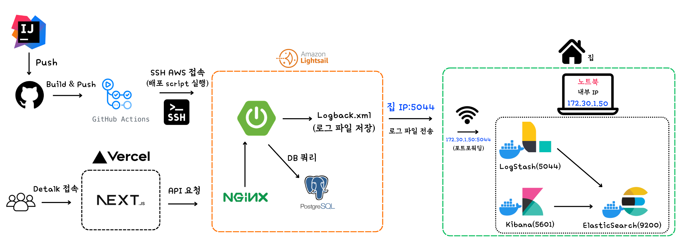
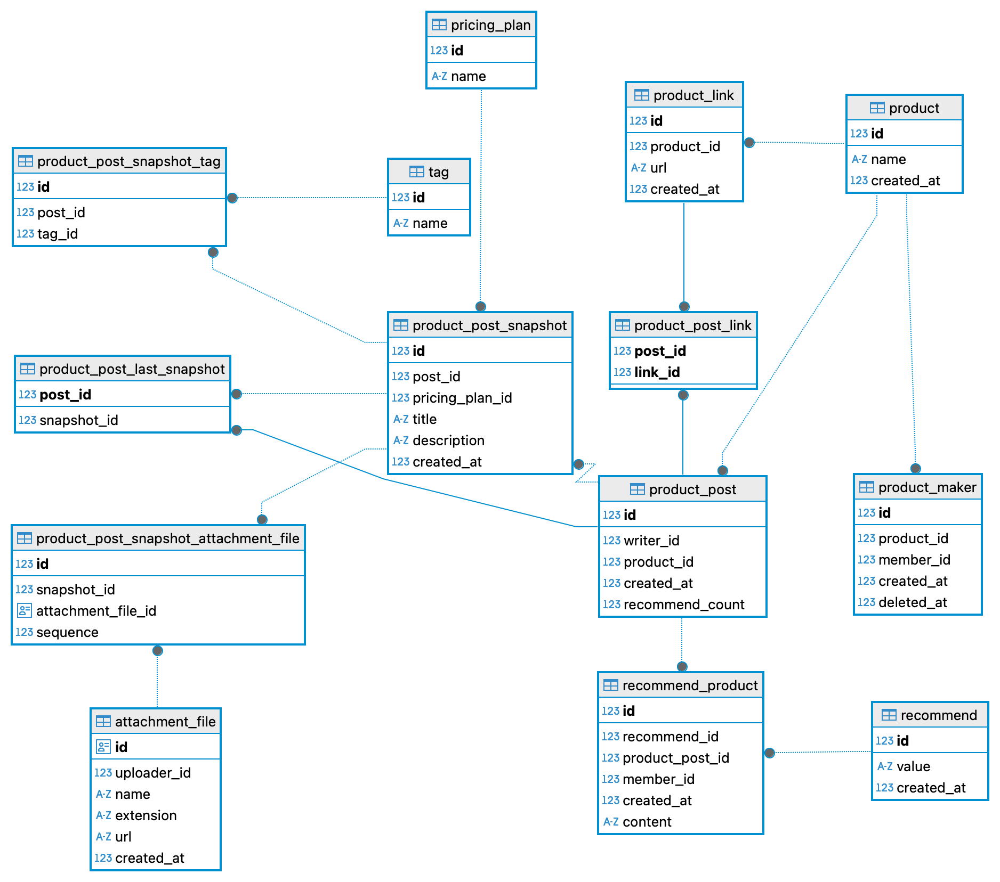
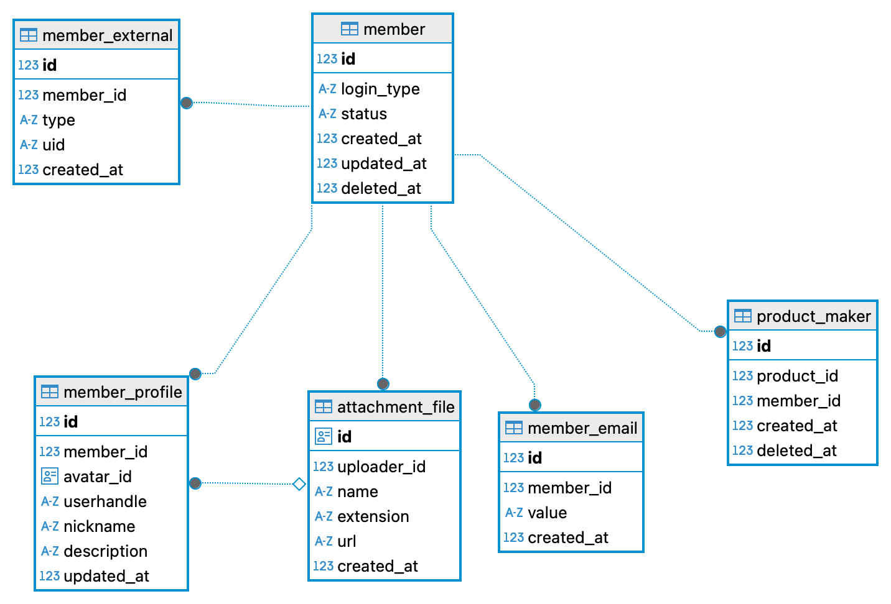

# [Detalk](https://detalk.net)

## 목차
- [규칙](#규칙)
- [시작하기](#시작하기)
- [기술](#기술)
    - [BackEnd](#backend)
    - [DataBase](#database)
    - [Infra](#infra)
- [아키텍처](#아키텍처)
- [ERD](#erd)
- [트러블슈팅](#트러블슈팅)

## 규칙
- **선 구현 후 추상화 & 리팩토링** : 기능을 먼저 구현하고, 이후 추상화하여 리팩토링하는 방식으로 개발합니다.

## 시작하기
0. 요구 사항

- **Java 21** 이상이 설치되어 있어야 합니다.
- PostgreSQL 데이터베이스 연결 정보가 필요합니다. (Docker나 로컬 설치 등 원하는 방식으로 PostgreSQL을 준비하고, application-*.yaml에 관련 설정을 기입하세요.)
1. git clone

```bash
git clone https://github.com/chanwukim/detalk-api.git
```

2. add `application-*.yaml`

`application-example.yaml`을 참고하여 `application-*.yaml`을 작성하세요.

3. execute `jooqCodegen`

`jooqCodegen`을 실행하여 JOOQ 코드를 생성하세요.

```bash
 ./gradlew jooqCodegen
```

4. deployment `jar`

```bash
// build jar
./gradlew clean build -x test

// jar deployment
java -jar build/libs/api-0.0.1-SNAPSHOT.jar

// health check
curl -i http://localhost:8080/api/health
```
---
## 기술

### BackEnd


### DataBase


### Infra


## 아키텍처



## ERD
#### 1. Product-Post
  
#### 2. Member
  

## 트러블슈팅
- 태그로 게시글 조회 시 풀스캔하는 쿼리 튜닝 [[PR #83](https://github.com/chanwukim/detalk-api/pull/83)]
- 에러 발생 또는 느린 쿼리문 디스코드 실시간 알람 봇 구현 [[PR #94](https://github.com/chanwukim/detalk-api/pull/94)]
- 멱등성으로 인한 중복 게시글 생성 문제 [[PR #106](https://github.com/chanwukim/detalk-api/pull/106)]